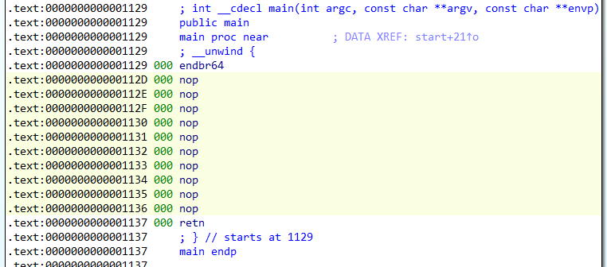
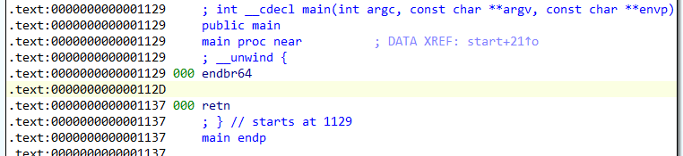

## NOP Filter

This is a simple plugin for Hex-Ray's IDA Pro disassembler to hide nop instructions.

## Requirement

* IDA Pro 7.7

## Install

* Copy 'nop-filter.py' to IDA's plugins folder. The plugin will be automatically loaded the next time you start IDA Pro.

## Usage

* Select `'Edit'` -> `'Plugins'` -> `'NOP Filter'`.

### Before

 

### After

 

## License

* MIT License

## Copyright

* Copyright (C) 2022 Hiroki Hada
* All rights reserved.

